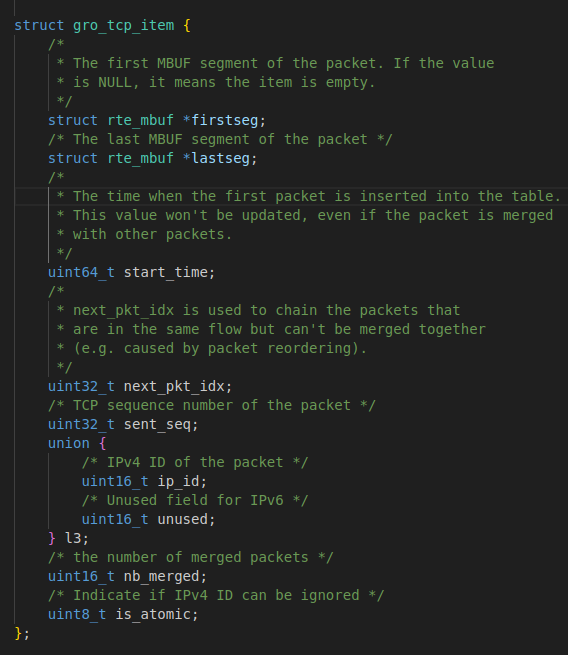
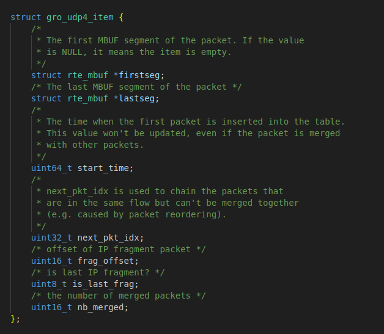
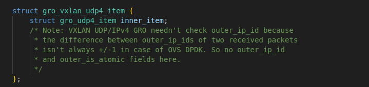
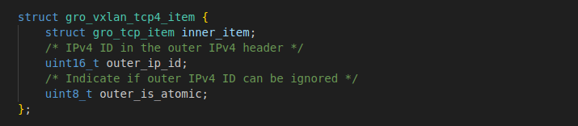
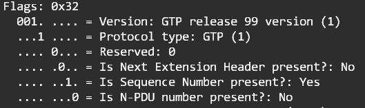
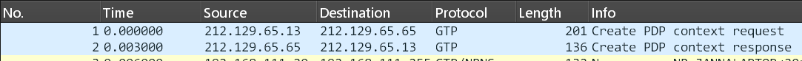
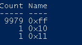

# Main Structure

| Type                           | Name                                 | Needs Initial Value | Reference                                             | Location | first line of similiar def/use |
|--------------------------------|--------------------------------------|---------------------|-------------------------------------------------------|----------|--------------------------------|
| #include                       | gro_gtp_<tcp/udp>4.h                 | No                  | rte_gro.c > gro_gtp_<tcp/udp>4.h                      | lib/gro/ | 11                             |
| static gro_tbl_create_fn       | gro_gtp_<tcp/udp>4_tbl_create        | No                  | rte_gro.c                                             | lib/gro/ | 23                             |
| static gro_tbl_destroy_fn      | gro_gtp_<tcp/udp>4_tbl_destroy       | No                  | rte_gro.c                                             | lib/gro/ | 26                             |
| static gro_tbl_pkt_count_fn    | gro_gtp_<tcp/udp>4_tbl_pkt_count     | No                  | rte_gro.c                                             | lib/gro/ | 31                             |
| #define                        | IS_IPV4_GTP_<TCP/UDP>4_PKT           | Yes                 | rte_gro.c > rte_gro.h > rte_mbuf.h > rte_mbuf_ptype.h | lib/gro/ | 37                             |
| struct gro_gtp_<tcp/udp>4_tbl  | gtp_<tcp/udp>_tbl                    | No                  | rte_gro.c > gro_gtp_<tcp/udp>4.h                      | lib/gro/ | 161                            |
| struct gro_gtp_<tcp/udp>4_flow | gtp_<tcp/udp>_flows                  | No                  | rte_gro.c > gro_gtp_<tcp/udp>4.h                      | lib/gro/ | 162                            |
| struct gro_gtp_<tcp/udp>4_item | gtp_<tcp/udp>_items                  | Yes                 | rte_gro.c > gro_gtp_<tcp/udp>4.h                      | lib/gro/ | 163                            |
| uint8_t                        | do_gtp_<tcp/udp>_gro                 | No                  | rte_gro.c                                             | lib/gro/ | 189                            |
| if parenthesis                 | RTE_GRO_IPV4_GTP_<TCP/UDP>_IPV4      | No                  | rte_gro.c > rte_gro.h                                 | lib/gro/ | 192                            |
| if pseducode                   |                                      | No                  | rte_gro.c                                             | lib/gro/ | 203                            |
| else if pseducode              |                                      | No                  | rte_gro.c                                             | lib/gro/ | 273                            |
| if pseducode                   | gro_gtp_<tcp/udp>4_tbl_timeout_flush | No                  | rte_gro.c > gro_gtp_<tcp/udp>4.h                      | lib/gro/ | 325                            |
| void *                         | gtp_<tcp/udp>_tbl                    | No                  | rte_gro.c                                             | lib/gro/ | 362                            |
| uint8_t                        | do_gtp_<tcp/udp>_gro                 | No                  | rte_gro.c                                             | lib/gro/ | 365                            |
| if parenthesis                 | RTE_GRO_IPV4_GTP_<TCP/UDP>_IPV4      | No                  | rte_gro.c > rte_gro.h                                 | lib/gro/ | 367                            |
| struct gro_gtp_<tcp/udp>4_tbl  | gtp_<tcp/udp>_tbl                    | No                  | rte_gro.c > gro_gtp_<tcp/udp>4.h                      | lib/gro/ | 373                            |
| else if pseducode              |                                      | No                  | rte_gro.c                                             | lib/gro/ | 392                            |
| if pseducode                   |                                      | No                  | rte_gro.c                                             | lib/gro/ | 440                            |


# Blueprint for Encapsulation: Deconstructing VXLAN GRO
The DPDK `rte_gro` library was designed to be extensible. The most compelling evidence of this is its support for Virtual Extensible LAN (VXLAN), a widely used encapsulation protocol. By deconstructing the existing VXLAN GRO implementation, we can derive a clear architectural blueprint for handling other tunneled protocols, such as GTP-U.

## VXLAN Packet Structure
A VXLAN packet encapsulates a full L2 Ethernet frame (the inner packet) within an outer UDP/IP header. The structure is as follows: `[Outer Ethernet Hdr] -> [Outer IP Hdr] -> -> [VXLAN Hdr] -> [Inner Ethernet Hdr] -> [Inner IP Hdr] -> -> [Payload]`. The VXLAN header itself is a simple 8-byte structure containing flags and, most importantly, a 24-bit VXLAN Network Identifier (VNI), which acts as a segment ID to isolate traffic from different tenants.   

## Defining the VXLAN GRO "Flow Key"
The core challenge in performing GRO on encapsulated traffic is to uniquely identify a flow that spans both the outer (transport) network and the inner (tenant) network. The VXLAN GRO implementation solves this by creating a composite key that aggregates fields from multiple layers of the packet. This demonstrates that the key-based algorithm is not rigidly tied to a 5-tuple but is a generic "header field aggregator."   

The flow key for a VXLAN-encapsulated TCP/IPv4 packet includes:

- **Outer Header Components**: The source and destination Ethernet and IPv4 addresses, and the outer UDP ports.

- **Tunnel Header Components**: The 24-bit VXLAN VNI.

- **Inner Header Components**: The inner source and destination Ethernet and IPv4 addresses, and the inner TCP ports.

This composite key ensures that two packets are considered part of the same flow only if they share the same transport tunnel endpoints (outer headers), belong to the same virtual network segment (VNI), and originate from the same inner connection (inner headers).

## Defining "Neighbor" Packets in a VXLAN Context

Similarly, the criteria for determining if two packets are neighbors and can be merged must also consider both the outer and inner headers. The VXLAN GRO implementation uses a dual-check logic :   

1. Outer IPv4 ID: If the Don't Fragment (DF) bit in the outer IPv4 header is clear, the IP Identification field of sequential packets must be incremented by one. This ensures that the outer transport packets are themselves in order.

2. Inner TCP Sequence Number: The TCP sequence number of the inner packet must be sequential with the packet it is being merged with. This is the standard TCP GRO check.

A merge is performed only if both conditions are met. This meticulous, dual-layer validation ensures the integrity of both the transport tunnel and the encapsulated user session.

## Architectural Lessons

The VXLAN GRO implementation provides a clear and powerful architectural pattern for extending the library. The key takeaways are:

- Extensibility: The core GRO engine is protocol-agnostic. It operates on opaque keys and item lists.

- Semantic vs. Mechanic Separation: There is a clean separation of concerns. Protocol-specific reassembly functions (e.g., vxlan_tcp_ipv4_reassemble) are responsible for the semantics—knowing which bytes to extract from which headers to build the key. The generic GRO engine handles the mechanics—hashing the key, managing the flow and item tables, and executing the merge.

- Flexibility of Keying: The keying mechanism is not limited to a fixed set of headers. It can be constructed from arbitrary fields across multiple protocol layers, including outer transport headers, tunnel-specific identifiers (like the VNI), and inner payload headers.

This architectural pattern proves that adding support for a new tunneling protocol does not require modifying the core GRO engine. Instead, it requires the development of a new protocol-specific "semantics" module that understands the new protocol's header format and can provide the key extraction and neighbor-checking logic. This is the blueprint that will be followed for designing the GTP-U GRO implementation.

## Code Breakdown


In this section, the initialization of data structures for Generic Receive Offload (GRO) in DPDK is explained, focusing on TCP, UDP, and VXLAN protocols.


1. **TCP/IPv4 GRO Initialization**
   The first part of the code deals with setting up the necessary structures for handling TCP packets over IPv4.

   ```c
   struct gro_tcp4_tbl tcp_tbl;
   struct gro_tcp4_flow tcp_flows[RTE_GRO_MAX_BURST_ITEM_NUM];
   struct gro_tcp_item tcp_items[RTE_GRO_MAX_BURST_ITEM_NUM] = { {0} };
   ```

   * `tcp_tbl`: Table for reassembling TCP packets over IPv4.
   * `tcp_flows`: Flow structures for tracking TCP/IPv4 packets.
   * `tcp_items`: Array that stores individual TCP packet segments.

2. **TCP/IPv6 GRO Initialization**
   This section is similar to the previous one but for TCP packets over IPv6.

   ```c
   struct gro_tcp6_tbl tcp6_tbl;
   struct gro_tcp6_flow tcp6_flows[RTE_GRO_MAX_BURST_ITEM_NUM];
   struct gro_tcp_item tcp6_items[RTE_GRO_MAX_BURST_ITEM_NUM] = { {0} };
   ```

   * `tcp6_tbl`: Table for reassembling TCP packets over IPv6.
   * `tcp6_flows`: Flow structures for TCP/IPv6 packets.
   * `tcp6_items`: Array of items for reassembling IPv6 packets.


> ▸ {0} ensures all array elements and structure fields are zero-initialized, preventing uninitialized values and ensuring a clean state.


### `gro_tcp_item` Structure




---


3. **UDP/IPv4 GRO Initialization**
   This part handles UDP packet reassembly over IPv4.

   ```c
   struct gro_udp4_tbl udp_tbl;
   struct gro_udp4_flow udp_flows[RTE_GRO_MAX_BURST_ITEM_NUM];
   struct gro_udp4_item udp_items[RTE_GRO_MAX_BURST_ITEM_NUM] = { {0} };
   ```

   * `udp_tbl`: Table for reassembling UDP packets over IPv4.
   * `udp_flows`: Flow structures for UDP/IPv4 packets.
   * `udp_items`: Array that stores individual UDP packet segments.

---
   > ▸ {0} ensures all array elements and structure fields are zero-initialized, preventing uninitialized values and ensuring a clean state.


### `gro_udp4_item` Structure




---

4. **VXLAN TCP/UDP GRO Initialization**
   This section initializes the structures for VXLAN (Virtual Extensible LAN) packets.

   * **VXLAN TCP**:

     ```c
     struct gro_vxlan_tcp4_tbl vxlan_tcp_tbl;
     struct gro_vxlan_tcp4_flow vxlan_tcp_flows[RTE_GRO_MAX_BURST_ITEM_NUM];
     struct gro_vxlan_tcp4_item vxlan_tcp_items[RTE_GRO_MAX_BURST_ITEM_NUM] = {{{0}, 0, 0} };
     ```

   * **VXLAN UDP**:

     ```c
     struct gro_vxlan_udp4_tbl vxlan_udp_tbl;
     struct gro_vxlan_udp4_flow vxlan_udp_flows[RTE_GRO_MAX_BURST_ITEM_NUM];
     struct gro_vxlan_udp4_item vxlan_udp_items[RTE_GRO_MAX_BURST_ITEM_NUM] = {{{0}} };
     ```

   These blocks initialize structures for reassembling VXLAN packets, both for TCP and UDP protocols.

    > ▸ The initialization of `vxlan_tcp_items` and `vxlan_udp_items` zeroes all fields in their respective structures.
     For `vxlan_tcp_items`, the triple braces (`{{{0}, 0, 0}}`) set `inner_item`, `outer_ip_id`, and `outer_is_atomic` to zero.
      For `vxlan_udp_items`, triple braces (`{{{0}}}`) zero-initialize `inner_item`.
     This ensures all fields in these arrays are cleanly initialized, preventing undefined behavior during VXLAN packet reassembly.


---

### 1. **Structure: gro_vxlan_udp4_item**



 

### 2. **Structure: gro_vxlan_tcp4_item**



---

* `gro_vxlan_udp4_item` is used for VXLAN over UDP. It only handles the inner UDP packet reassembly and doesn't deal with the outer IPv4 header, as in many cases (like OVS DPDK), the outer IP ID isn't relevant.

* `gro_vxlan_tcp4_item` is used for VXLAN over TCP. In addition to handling inner TCP packet reassembly, it includes fields (`outer_ip_id` and `outer_is_atomic`) to manage the outer IPv4 header, which is important for reassembly in TCP-based VXLAN.

The main difference is how they handle the outer IP header: `gro_vxlan_tcp4_item` includes specific fields for it, while `gro_vxlan_udp4_item` does not.


---

The code initializes the necessary structures for GRO across TCP, UDP, and VXLAN protocols, ensuring all data is set to a clean initial state (zero) for efficient packet processing. Similarly, **GTP** (GPRS Tunneling Protocol) also has both **outer** and **inner headers**, making its design comparable to **VXLAN**. The outer header in GTP is responsible for packet tunneling and routing, while the inner header carries the user data or control messages, much like how **VXLAN** handles encapsulated data with outer and inner headers.

# GTP-U Packet Aggregation Workflow
## Step 1: Packet Identification and Pre-filtering
The first stage of the aggregation pipeline is to efficiently identify potential GTP-U packets from the general stream of incoming traffic. The standard and most efficient method is to filter based on the UDP destination port. Traffic destined for UDP port 2152 is considered candidate GTP-U traffic. 

Upon identification, the application should set the packet's `mbuf->packet_type` field to a newly defined type, such as `RTE_PTYPE_TUNNEL_GTPU_IPV4`. This classification is crucial as it allows the main GRO library dispatcher to route the packet to the custom GTP-U handler functions that will be developed. 

Immediately following identification, a pre-filtering step must be performed. The handler must parse the first octet of the GTP header and validate the `Version` field (must be 1) and the `Protocol Type` (PT) flag (must be 1). Any packet that fails these checks is not a valid GTPv1-U packet for aggregation and must be immediately removed from the GRO pipeline and passed through to the application.

## Step 2: Constructing the GTP-U Flow Key

Following the design principles established by the VXLAN GRO implementation, a composite key is mandatory for robust and accurate flow classification. The key must uniquely identify a specific user's data flow between a specific pair of network endpoints. A minimal but effective key structure for GTP-U would consist of:

- **Outer L3 Source and Destination Addresses (IPv4 or IPv6)**: These fields uniquely identify the tunnel endpoints (e.g., the gNodeB and the UPF).

- **GTP-U TEID**: This 32-bit field uniquely identifies the user's PDU session or bearer context within that specific tunnel. 

This composite key ensures that even if two different pairs of tunnel endpoints happen to use the same TEID, their flows will be kept separate by the differing outer IP addresses, preventing data corruption. While the inner packet's 5-tuple (source/destination IPs, protocol, source/destination ports) could also be added to the key for even finer granularity, this adds significant computational overhead. Given that the TEID is allocated by the control plane to uniquely identify a user session, a key based on `Outer IPs + TEID` is the most efficient and is sufficient for correct operation.

## Step 3: Defining Merging Criteria ("Neighbor" Logic)

This step defines the precise rules that determine if two packets from the same flow are "neighbors" and can be merged. The logic is fundamentally split based on the state of the GTP header's 'S' (Sequence Number) flag.

### Scenario A: Sequenced Flow (S Flag = 1)
When the 'S' flag is set, the 16-bit Sequence Number field is present and valid, enabling a highly reliable, TCP-like merging strategy. A new packet can be merged with the last packet of an existing GRO segment if and only if:

1. The new packet's Sequence Number is exactly one greater than the Sequence Number of the last packet in the segment.

2. All other header fields that constitute the flow's identity (e.g., outer IPs, TEID, inner 5-tuple if used) are identical.

3. Protocol-level flags that would break contiguity (e.g., inner TCP SYN/FIN/RST flags) are not set.

### Scenario B: Unsequenced Flow (S Flag = 0)

When the 'S' flag is not set, there is no reliable sequence number to guide the merge. In this scenario, the implementation must fall back to a best-effort heuristic. The most viable approach is to model the logic after the existing non-TCP GRO implementations, such as those for VXLAN-encapsulated UDP traffic. This typically involves checking the inner IPv4 header's Identification field for contiguity. A new packet is considered a neighbor if its inner IPv4 ID is one greater than the inner IPv4 ID of the previous packet. This method is less reliable than using a dedicated sequence number. Therefore, it is strongly recommended that this behavior be made configurable, allowing a network operator to disable GRO for unsequenced GTP-U flows if it proves to be a source of packet corruption in their specific network environment. 

## Step 4: The Reassembly Algorithm in Action

With the keying and merging logic defined, the packet processing flow within the heavyweight GRO context proceeds as follows for each incoming GTP-U packet:

1. The `rte_gro_reassemble()` function is called with a burst of packets.

2. For each candidate GTP-U packet, the composite flow key (Outer IPs + TEID) is computed.

3. A lookup is performed in the GRO context's hash table using this key to find the corresponding flow entry.

4. **If a flow entry exists**: The algorithm iterates through the mbufs already stored for that flow. It applies the "Neighbor Logic" defined in Step 3.3. If a neighbor is found, the new mbuf is merged. This typically involves updating the total length and segment count of the first mbuf in the chain and appending the new mbuf's data segments to the chain. The mbuf of the new packet is then freed.

5. **If no flow entry exists**: This is the first packet seen for this flow. A new flow entry is allocated in the hash table, and the current mbuf is stored as the first and only packet in its reassembly list. It will now wait for a subsequent neighbor to arrive.

## Step 5: Managing Protocol Variations and Edge Cases

A production-ready implementation must handle protocol variations and edge cases gracefully.

- **Extension Headers (E Flag = 1)**: The presence of GTP Extension Headers introduces significant parsing complexity, as they form a variable-length chain. The safest and most practical initial approach is to treat any packet with the 'E' flag set as non-mergeable. When such a packet arrives for a given flow, it should first trigger a flush of any existing aggregated segment for that flow, and then be passed through to the application unmodified.

- **Out-of-Order Packets**: The key-based algorithm's "store-and-wait" mechanism naturally handles out-of-order packets. If a packet arrives whose sequence number is, for example, N+2, but the last packet seen was N, it will not be identified as a neighbor. It will simply be stored in the flow's reassembly table, awaiting the arrival of packet N+1.

## Step 6: Flushing Strategies for Latency and Throughput

An aggregated packet segment cannot remain in the GRO reassembly table indefinitely, as this would introduce unbounded latency. Flushing is the process of dequeuing these segments and passing them to the application. Flushing is triggered by several conditions, and the strategy chosen represents a critical trade-off between maximizing aggregation efficiency (and thus throughput) and minimizing latency.

- **Timeout-Based Flush**: The rte_gro_timeout_flush() function provides the most deterministic control over latency. This function can be called periodically by the application, and it will flush any segments that have been held in the reassembly tables for longer than a specified timeout_cycles value (measured in nanoseconds). This is essential for latency-sensitive applications like voice or real-time data. 

- **Event-Based Flush**: A flush is also implicitly triggered by network events that break packet contiguity. These include the arrival of a packet for a flow that is not a neighbor, the arrival of a non-G-PDU signaling message for that flow, or the reassembly table for a flow reaching its configured maximum size.

- **Periodic/Cycle-Based Flush**: As demonstrated in the testpmd application, flushing can be configured to occur every N processing cycles (set gro flush <cycles>). This provides a simple, load-dependent mechanism to ensure data is regularly forwarded. 

The choice of flushing strategy must be deliberate. Furthermore, the reassembly tables themselves represent a finite memory resource. An attacker could launch a Denial-of-Service (DoS) attack by sending a flood of packets with randomized TEIDs, quickly exhausting the GRO hash table and preventing legitimate flows from being processed. Therefore, a robust implementation must include strict resource management: a maximum number of flows, a maximum number of stored packets per flow, and an aggressive timeout-based flushing policy to purge stale, incomplete flows.

# What is GTP?

- **GTP** = GPRS Tunneling Protocol
- Used in **3G, 4G (LTE), and early 5G** mobile core networks.
- Purpose: Carries **user data** (like IP packets) and **control signaling** (like session management) between core network elements.
- Works over **UDP/IP**, usually on port **2152 (GTP-U)** and **2123 (GTP-C)**.

------

# GTP Versions

- **GTPv0** → Old (2G).
- **GTPv1** → Still widely used in 3G/4G.
- **GTPv2** → Used in EPC (LTE core, mainly control).

------

# Two Main Types of GTPv1

1. **GTP-C (Control Plane)**
   - Manages sessions (create, modify, delete tunnels).
   - Uses UDP **port 2123**.
2. **GTP-U (User Plane)**
   - Carries **user traffic (IP packets, voice, video, etc.)**.
   - Uses UDP **port 2152**.

------

# GTP-v1 Packet Structure

## GTP Common Header (minimum 8 bytes)

Every GTP packet starts with this:

| Field                                  | Size | Description                                                  |
| -------------------------------------- | ---- | ------------------------------------------------------------ |
| **Flags (Version, PT, E, S, PN bits)** | 1B   | Protocol type, extensions, sequence info                     |
| **Message Type**                       | 1B   | Defines packet purpose (e.g., Echo Request, T-PDU, Create Session) |
| **Length**                             | 2B   | Payload length (excluding header)                            |
| **Tunnel Endpoint Identifier (TEID)**  | 4B   | Key that identifies the tunnel                               |

------

## Optional Fields

If flags indicate extensions, extra fields are present:

- **Sequence Number** (2B)
  Identifies this PDU in sequence
- **N-PDU Number** (1B)
  Used for reordering (rare in LTE)
- **Next Extension Header Type** (1B)

------

# Key Fields Explained

- **TEID (Tunnel Endpoint Identifier)**

  - Identifies the tunnel between nodes.

- **Message Type**:

  - Identifies the message type. Here are all message types in GTP version 1:

    | Decimal | Hex    | Message Type                             |
    | ------- | ------ | ---------------------------------------- |
    | **1**   | **1**  | **Echo Request**                         |
    | **2**   | **2**  | **Echo Response**                        |
    | 3       | 3      | Version Not Supported                    |
    | 4       | 4      | Node Alive Request                       |
    | 5       | 5      | Node Alive Response                      |
    | 6       | 6      | Redirection Request                      |
    | 7       | 7      | Redirection Response                     |
    | **16**  | **10** | **Create PDP Context Request**           |
    | **17**  | **11** | **Create PDP Context Response**          |
    | 18      | 12     | Update PDP Context Request               |
    | 19      | 13     | Update PDP Context Response              |
    | 20      | 14     | Delete PDP Context Request               |
    | 21      | 15     | Delete PDP Context Response              |
    | 22      | 16     | Initiate PDP Context Activation Request  |
    | 23      | 17     | Initiate PDP Context Activation Response |
    | 26      | 1A     | Error Indication                         |
    | 27      | 1B     | PDU Notification Request                 |
    | 28      | 1C     | PDU Notification Response                |
    | 29      | 1D     | PDU Notification Reject Request          |
    | 30      | 1E     | PDU Notification Reject Response         |
    | 31      | 1F     | Supported Extensions Header Notification |
    | 32      | 20     | Send Routing for GPRS Request            |
    | 33      | 21     | Send Routing for GPRS Response           |
    | 34      | 22     | Failure Report Request                   |
    | 35      | 23     | Failure Report Response                  |
    | 36      | 24     | Note MS Present Request                  |
    | 37      | 25     | Note MS Present Response                 |
    | 38      | 26     | Identification Request                   |
    | 39      | 27     | Identification Response                  |
    | 50      | 32     | SGSN Context Request                     |
    | 51      | 33     | SGSN Context Response                    |
    | 52      | 34     | SGSN Context Acknowledge                 |
    | 53      | 35     | Forward Relocation Request               |
    | 54      | 36     | Forward Relocation Response              |
    | 55      | 37     | Forward Relocation Complete              |
    | 56      | 38     | Relocation Cancel Request                |
    | 57      | 39     | Relocation Cancel Response               |
    | 58      | 3A     | Forward SRNS Context                     |
    | 59      | 3B     | Forward Relocation Complete Acknowledge  |
    | 60      | 3C     | Forward SRNS Context Acknowledge         |
    | 61      | 3D     | UE Registration Request                  |
    | 62      | 3E     | UE Registration Response                 |
    | 70      | 46     | RAN Information Relay                    |
    | 96      | 60     | MBMS Notification Request                |
    | 97      | 61     | MBMS Notification Response               |
    | 98      | 62     | MBMS Notification Reject Request         |
    | 99      | 63     | MBMS Notification Reject Response        |
    | 100     | 64     | Create MBMS Notification Request         |
    | 101     | 65     | Create MBMS Notification Response        |
    | 102     | 66     | Update MBMS Notification Request         |
    | 103     | 67     | Update MBMS Notification Response        |
    | 104     | 68     | Delete MBMS Notification Request         |
    | 105     | 69     | Delete MBMS Notification Response        |
    | 112     | 70     | MBMS Registration Request                |
    | 113     | 71     | MBMS Registration Response               |
    | 114     | 72     | MBMS De-Registration Request             |
    | 115     | 73     | MBMS De-Registration Response            |
    | 116     | 74     | MBMS Session Start Request               |
    | 117     | 75     | MBMS Session Start Response              |
    | 118     | 76     | MBMS Session Stop Request                |
    | 119     | 77     | MBMS Session Stop Response               |
    | 120     | 78     | MBMS Session Update Request              |
    | 121     | 79     | MBMS Session Update Response             |
    | 128     | 80     | MS Info Change Request                   |
    | 129     | 81     | MS Info Change Response                  |
    | 240     | F0     | Data Record Transfer Request             |
    | 241     | F1     | Data Record Transfer Response            |
    | 254     | FE     | End Marker                               |
    | 255     | FF     | G-PDU                                    |

    Here are some important message types explained:

    | Message Type                                      | Value | Purpose                                                      |
    | ------------------------------------------------- | ----- | ------------------------------------------------------------ |
    | **Echo Request (1)**                              | 1     | "Hello, are you alive?" – keepalive check between nodes (SGSN, GGSN, SGW, PGW). |
    | **Echo Response (2)**                             | 2     | Reply to Echo Request. Confirms node is reachable.           |
    | **Create PDP Context Request (16)**               | 16    | Sent by SGSN → GGSN to set up a new session (PDP context = subscriber session). Contains IMSI, APN, QoS, TEID. |
    | **Create PDP Context Response (17)**              | 17    | Reply from GGSN with result (success/failure), assigned TEIDs. |
    | **Update PDP Context Request (18)**               | 18    | Modify an existing session (QoS change, new SGSN after handover, etc.). |
    | **Update PDP Context Response (19)**              | 19    | Reply to the update request.                                 |
    | **Delete PDP Context Request (20)**               | 20    | Tear down a subscriber’s session (release tunnel, free TEIDs). |
    | **Delete PDP Context Response (21)**              | 21    | Acknowledgement of deletion.                                 |
    | **Error Indication (26)**                         | 26    | Sent if a packet arrives with an unknown TEID or other errors. |
    | **Supported Extension Headers Notification (31)** | 31    | Lets peers know which optional extensions they support.      |

- **Flags**

  - Version = 1 (for GTPv1).
  - PT = Protocol Type (GTP = 1, GTP’ = 0).
  - E, S, PN = indicate optional fields (extension headers, sequence number, N-PDU).
  - Example of a Control Plane GTP packet flags:
    

------

#  GTPv1-U Example (User Plane)

When a user streams YouTube on 4G:

- The **IP packet** (from user’s phone) gets wrapped in GTPv1-U.
- GTP header (with TEID) + user’s IP packet payload.
- Sent via **UDP 2152** → across the mobile core → unwrapped at destination.

------

#  GTPv1-C Example (Control Plane)

When a user attaches to the network:

- SGSN (Serving GPRS Support Node) sends **Create PDP Context Request** to GGSN (with IMSI, APN, QoS).
- GGSN (Gateway GPRS Support Node) replies with **Create PDP Context Response** (accept/reject, assigns TEID).
- Tunnel is established.

Certainly! I've analyzed the provided GTPv1 packet capture file from CloudShark. Here's a detailed analysis report based on the observed traffic:

------

# **test.pcap Analysis Report**

First a Context Request and Response exchange happened:



Using this command in Windows PowerShell gives us all different message types of this pcap file:

```powershell
.\tshark.exe -r /path/to/your/capture.pcap -Y gtp -T fields -e gtp.message | Group-Object | Sort-Object Count -Descending | Format-Table Count, Name
```

Same action can be performed using Linux terminal:

```bash
tshark -r /path/to/your/capture.pcap -Y gtp -T fields -e gtp.msg_type | sort | uniq -c
```

The output for this capture file is:


It indicates the first handshake at the beginning of the capture file and the rest of the file which is only data exchange judging by the message type 255 which indicates GTP user plane packets.

### **Findings**

- It looks like a **successful attach and data session**:
  - Request (16) from SGSN/SGW → Response (17) from GGSN/PGW → steady GTP-U 255 packets.
- No delete messages captured → session probably continued beyond the trace.
- Network health looks normal (no error responses, no rejects)
